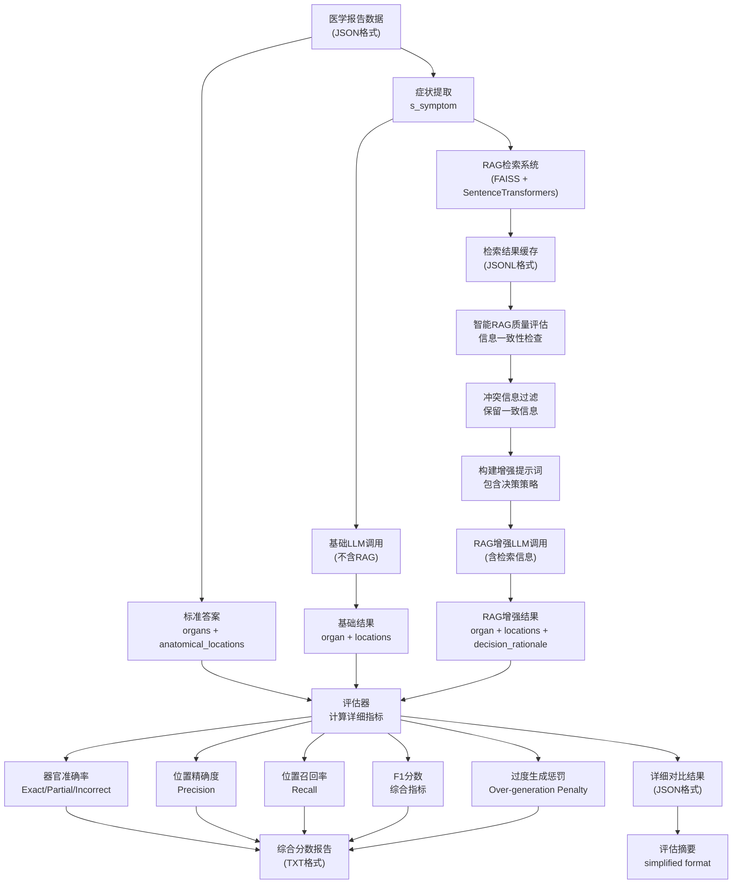

# 🎯 RAG医学诊断评估系统 - 完整工作流分析

## 📋 系统概述

这是一个基于RAG（Retrieval-Augmented Generation）的医学诊断评估系统，旨在**评估检索增强能否提升大语言模型在医学诊断中的准确性**。

## 🔄 评估工作流程

### 第一阶段：数据准备与RAG检索

```bash
# 启动命令
python start_evaluation.py full 4050 4059 --config config/config_cn.yaml
```

#### 🔍 输入数据结构 (IO Input)

```json
{
  "s_symptom": "central line placement",  // 症状描述
  "U_unit_set": [                        // 标准答案集
    {
      "u_unit": {
        "d_diagnosis": "...",             // 诊断详情
        "o_organ": {
          "organName": "Heart (Cor)",     // 期望器官
          "anatomicalLocations": [        // 期望解剖位置
            "Aortic Valve", "Mitral Valve"
          ]
        }
      }
    }
  ]
}
```

### 第二阶段：智能RAG检索

**📂 RAG检索环境**: `RAG_Build` (FAISS + GPU)
- **检索引擎**: 基于SentenceTransformers的语义搜索
- **索引库**: 86,635个医学单元，31,443个症状
- **输出**: 结构化JSONL格式

#### 📋 RAG输出格式

```json
{
  "query": "central line placement",
  "s": {
    "rag_s_1_id": {
      "s_text": "central line placement",
      "units": [{
        "u_unit": {
          "d_diagnosis": "检索到的诊断信息",
          "o_organ": {
            "organName": "Vein (Vena)",
            "anatomicalLocations": ["Superior Vena Cava"]
          }
        }
      }]
    }
  }
}
```

### 第三阶段：智能增强策略

#### 🧠 RAG质量评估算法

- **信息一致性检查**: 检测器官信息冲突
- **质量评分**: 基于文本长度、医学术语、器官信息完整性
- **冲突处理**: 过滤不一致信息，保留最常见器官的数据

#### ⚖️ 决策策略

```
质量分数 > 0.6  → 🎯 建议重点参考
质量分数 > 0.3  → ⚖️ 建议谨慎参考  
存在冲突      → ⚠️ 建议主要依据医学知识
```

### 第四阶段：双轨评估

**🤖 API调用环境**: `rag5090` (Python 3.10)
- **Baseline评估**: 纯LLM，无RAG信息
- **RAG增强评估**: LLM + 智能RAG上下文

#### 📤 LLM输出格式

```json
{
  "organ": "识别的器官",
  "anatomical_locations": ["解剖位置1", "位置2"],
  "rag_quality_used": 0.70,           // 新增：RAG质量分数
  "decision_rationale": "决策依据说明"  // 新增：决策理由
}
```

### 第五阶段：详细评估指标

#### 📊 评估维度

1. **器官准确率**：
   - ✅ **精确匹配** (Exact Match): 完全正确
   - ⚠️ **部分匹配** (Partial Match): 部分正确
   - ❌ **完全错误** (Incorrect): 未识别正确器官

2. **解剖位置评估**：
   - **精确率** = 正确识别数 / API返回总数
   - **召回率** = 正确识别数 / 标准答案总数  
   - **F1分数** = 2 × (精确率 × 召回率) / (精确率 + 召回率)

3. **过度生成惩罚**：
   - 防止模型输出过多无关位置
   - 惩罚机制确保答案精准性

## 📁 输出文件结构 (IO Output)

```
final_result/
├── baseline_results/           # 基础LLM结果
│   └── report_diagnostic_*_evaluation_*.json
├── rag_search_output/         # RAG检索缓存  
│   ├── report_*_ragoutcome:*.jsonl
│   └── report_*_ragoutcome:*_pretty.json
├── rerun_with_rag/           # RAG增强结果
│   └── report_*_withRAG_*.json
└── rerun_comparisons/        # 对比分析
    ├── report_*_comparison_*.json
    └── report_*_results_*/
        ├── report_*_evaluation_summary.json  # 简化摘要
        └── report_*_rag_score_report.txt    # 详细分数报告
```

## 🎯 系统评估什么？

### 核心评估目标

1. **RAG检索是否提升LLM医学诊断准确性**
2. **不同API对RAG信息的利用效果**  
3. **智能RAG质量控制机制的有效性**

### 评估对象

- **症状** → **器官** + **解剖位置** 的映射准确性
- **多API对比**：Deepseek、Moonshot、OpenAI、Anthropic、Gemini
- **检索质量**：RAG信息的相关性和一致性

### 评估标准

- **医学标准答案**：来自训练数据集的专家标注
- **定量指标**：精确率、召回率、F1分数、综合得分
- **定性分析**：器官识别准确性、位置信息完整性

## 🏆 批量测试结果概览

**📊 10个报告，80个症状的综合分析**：

| API | 改善比例 | 负面影响 | 净效果 | 结论 |
|-----|----------|----------|--------|------|
| **Deepseek** | 32.5% | 13.8% | **+18.8%** | 🎯 显著改善 |
| **Moonshot** | 26.2% | 25.0% | **+1.2%** | ⚖️ 轻微改善 |

**🎯 总体结论**：
✅ **智能RAG系统总体有效**，能够改善LLM在医学诊断中的准确性，特别是在器官识别和解剖位置定位方面。

## 🚀 技术创新点

1. **智能RAG质量评估**: 自动检测信息冲突和质量
2. **决策策略机制**: 让LLM理性选择是否信任RAG
3. **多维度评估**: 器官+位置+过度生成的综合评估
4. **自动化流程**: 从检索到评估的完整自动化管道
5. **GPU加速**: RTX 5090 + FAISS-GPU实现高效检索

## 📋 系统架构图



## 🛠️ 使用方法

### 基本使用

```bash
# 完整RAG评估流程 (单个报告)
python start_evaluation.py full 4050

# 批量评估多个报告
python start_evaluation.py full 4050 4059

# 使用特定配置文件
python start_evaluation.py full 4050 4059 --config config/config_cn.yaml

# 只运行baseline评估
python start_evaluation.py baseline 4050 4059

# 只运行RAG增强评估 (需要已有RAG缓存)
python start_evaluation.py rag-only 4050 4059
```

### 并发评估

```bash
# 运行并发评估 (两个不同配置同时进行)
python run_concurrent_evaluation.py
```

### 工作流选择

- **`full`**: 完整流程 (RAG检索 + 评估 + 对比)
- **`baseline`**: 仅基础LLM评估
- **`rag-only`**: 仅RAG增强评估
- **`retrieve`**: 仅RAG检索

## 📊 结果分析

系统为**RAG在专业领域的应用**提供了一个完整的评估框架，特别适用于需要高准确性的医学诊断场景。通过智能质量控制和多维度评估，能够有效验证RAG技术在提升LLM专业能力方面的价值。

---

*本文档记录了RAG医学诊断评估系统的完整工作流程和技术实现，为后续的系统优化和扩展提供了详细的参考。*
